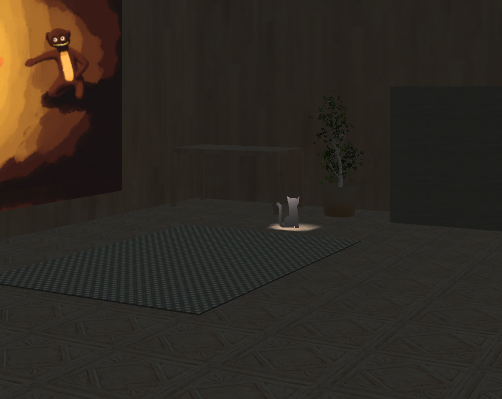

# FindTheCat
## Background
**Made for:** Ludum Dare 31

**Theme:** Entire Game on One Screen

**Duration:** 48 hours

## About the game
This is a point-and-click game where the goal is to find a cat that is hiding in a room.

*(Hint: you can click on things)*

## Technologies
- Unity with C#
- SketchUp
- Blender
- Photoshop

## Sneak peek

